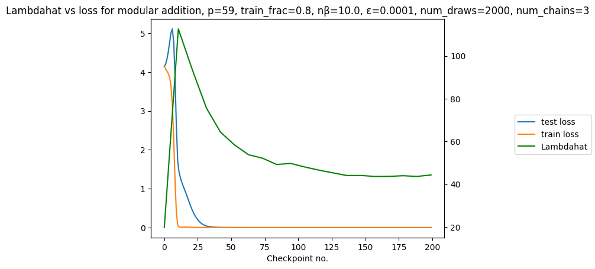

# LLC analysis of grokking on modular arithmetic

Disclaimer: This is WIP.

## Goals of the project

* Practice coding something in PyTorch from scratch
* Make some progress on a developmental interpretability [project](https://timaeus.co/projects/grokking) from Timaeus.

## Plan

1. Reimplement some experiments from [The Clock and the Pizza: Two Stories in Mechanistic Explanation of Neural Networks](https://arxiv.org/abs/2306.17844). (They shared the code, but as mentioned earlier, I would like to write something from scratch.)
2. Make sure we can searate pizza and clock solutions.
3. Track LLC during training. Can we differentiate Pizza and Clock solutions based on the LLC?
4. Investigate other scenarios. (Expand plan.)

## Latest results
* For constant attention, gradient symmetry is always `0.99`. For normal attention (`attention_rate = 1`), it varies between `0.41` and `0.75`.
* Based on the experiments, attention 1 consistently has lower LLC  estimate (between 24 and 31) than attention 0 (between 45 and 69).
    * Combining this with gradient symmetry results, this suggests that Clock has lower LLC than Pizza. Yay!
    * I needed to use high localization (100) to get converging chains. I need to understand if that is ok.
* I have some LLC curves like this
     
    * The shape of the curves are very similar for attention `0` and `1`. Estimated LLC is higher for attention `0` (matching previous experiments)
    * They go down long after the test loss is `0`, which is surprising. Possible next question: can I confirm that this is some kind of pruning? E.g. see that some Fourier frequencies are being pruned away?
    * Caveat: I logged train/test loss after every `10` steps and saved model state only every `100` steps. This means the LLC is estimated only after `100` steps and that is quite late. (The train has already fallen to `0`.) I will rerun these with frequent LLC estimates.
