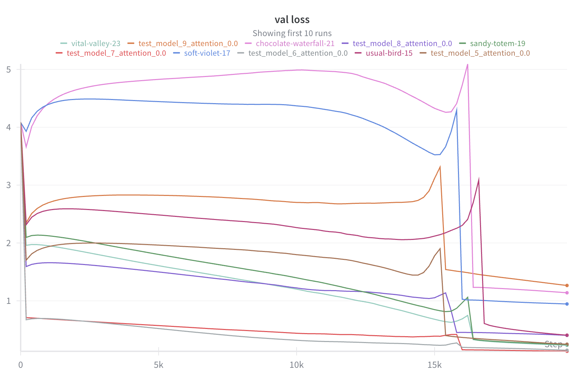
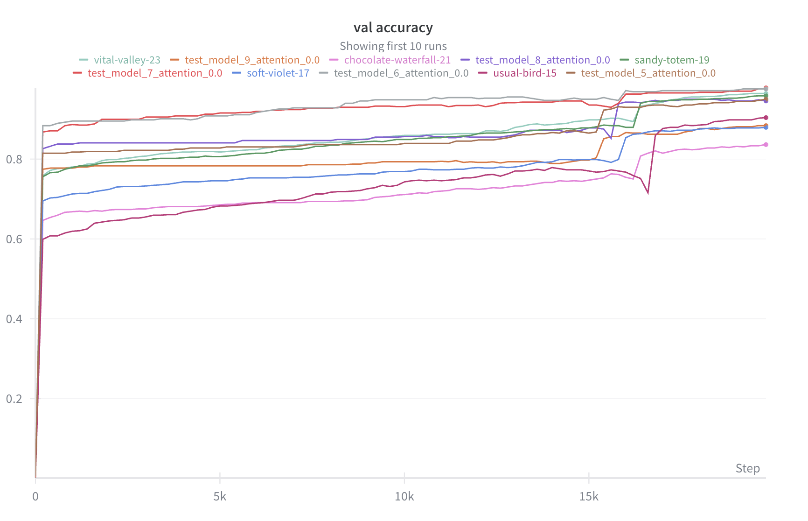
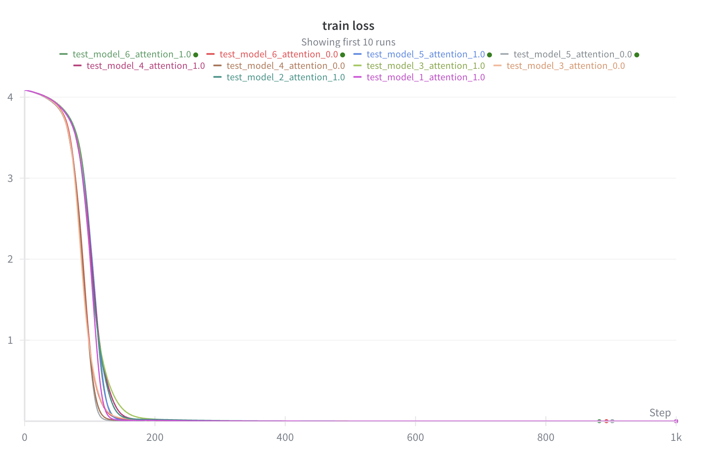
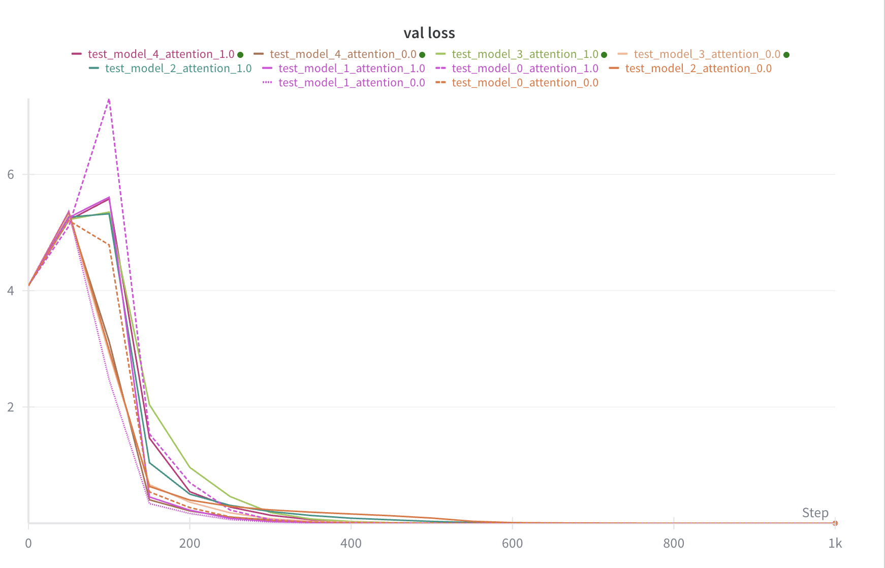
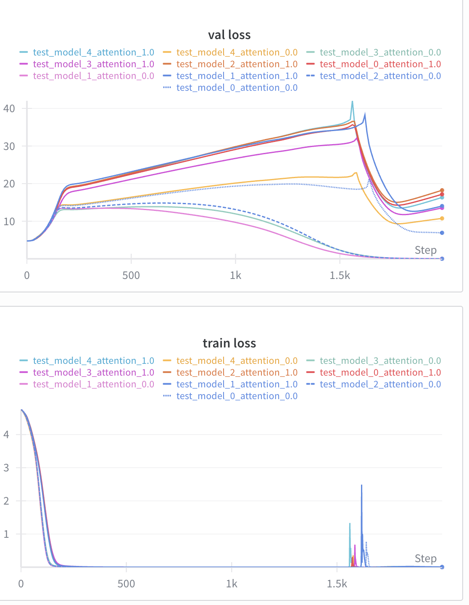
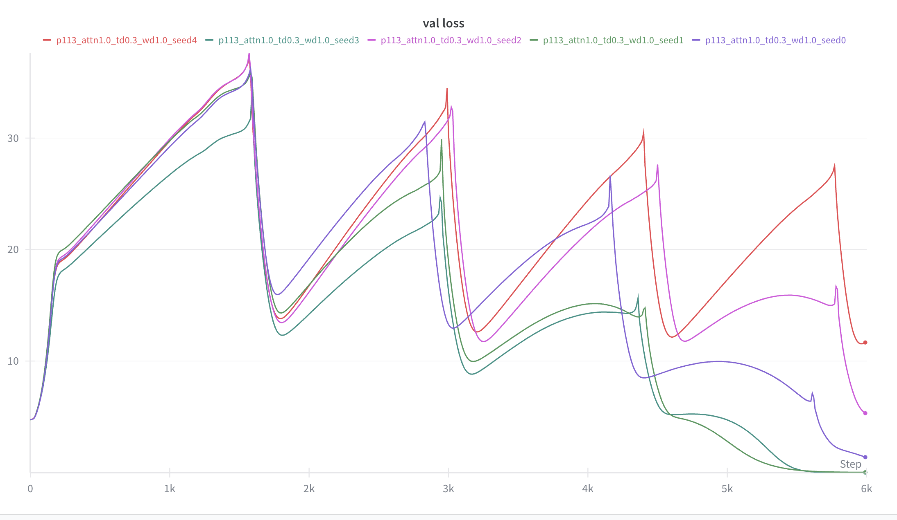

# LLC analysis of grokking on modular arithmetic

Disclaimer: This project is WIP, I am currently just in the process of reimplementing the Pizza and the Clock paper.

## Goals of the project

* Practice coding something in PyTorch from scratch
* Make some progress on a developmental interpretability [project](https://timaeus.co/projects/grokking) from Timaeus.

## Plan

1. Reimplement some experiments from [The Clock and the Pizza: Two Stories in Mechanistic Explanation of Neural Networks](https://arxiv.org/abs/2306.17844). (They shared the code, but as mentioned earlier, I would like to write something from scratch.)
2. Make sure we can searate pizza and clock solutions.
3. Track LLC during training. Can we differentiate Pizza and Clock solutions based on the LLC?
4. Investigate other scenarios. (Expand plan.)


## Journal
* Reimplemented the models from the paper, they kind of work. There is a sudden drop in validation loss after 15000 steps, but the models do not reach 100% validation accuracy. Why?



* What differences are there between my implementation and theirs?
    *  I used `nn.Embedding`, which initializes the weight matrix from $\mathcal{N}(0,1)$, while tha paper used `torch.randn(d_model, d_vocab)/np.sqrt(d_model)` for weight init. The difference is the scaling by the square root of `d_model`.
    * For unembedding, I used `nn.Linear`. The first problem is that I also added a bias. The second in the initialization again. `nn.Linear` uses a uniform distribution, the original paper uses a scaled uniform distribution. `torch.randn(d_model, d_vocab)/np.sqrt(d_vocab))`
    * In general, they always initialize things such that the output of the layer will start with 1 std.
    * It is important that the weight decay is $2$, not $1e-2$...
    * I didn't have a scheduler that ramps up the learning rate to the given value gradually, during the first 10 steps. Not sure if this is important.
    * I had other bugs, like sometimes forgetting to use `nn.Parameter`.
* Now I have validation accuracy $1$! There is a small delay in the validation loss dropping to $0$ after the training loss has dropped to $0$.This is grokking, but not as pronounced as in the Nanda paper.


* I got a little hang up on getting nice grokking models, but that is a tangent now.
    * Nanda used $30$% of the data, not $80%$, so learning the real rule was more difficult than here. I run some short experiments with 30% training data. I could see the grokking for some of the trajectories and the validation accuracy not dropping for others. 
    
    * From an LLC research point of view, it would be best to find parameters where grokking is clearly separated from memorization, but it doesn't take too long to grok.
    * Got some runs with different parameters. In some cases, the validation loss looks like this. Maybe it learns multiple different algorithms as time passes? (Might worth getting back tot hese runs once I have finished the pizza/clock experiments. This is not a one-off thing, it happened multiple times. Probably this is what happens with some of the runs on the previous plot.)
    

    [Link](https://wandb.ai/gahanna999-/modular-addition-attention-grokking-sweep?nw=nwusergahanna999) to all experiments. I singled out a few where the grokking is nicely separated:
        ```
        p, tf, wd = (113, 0.5, 1.5)
        p, tf, wd = (59, 0.5, 2.0)
        p, tf, wd = (59, 0.5, 1.0)
        ```

